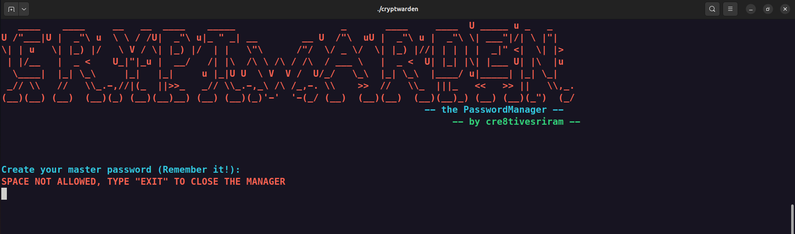
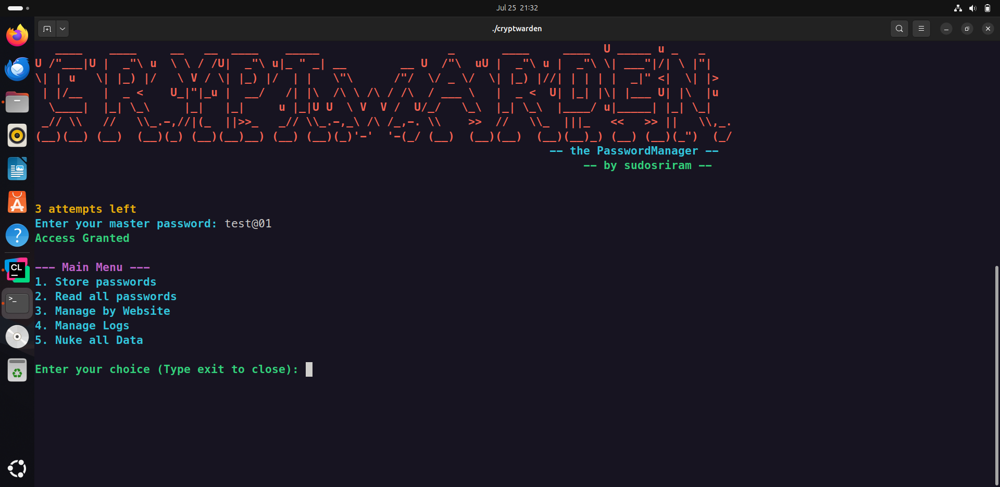

# CryptWarden 🔐

A secure, terminal-based password manager written in C — with encryption, fuzzy search, log management, and a clean CLI experience.

🧠 Built solo in 1 week — May 26 to early June 2025  
🚀 Pushed to GitHub on July 24, 2025

---

## ⚙️ Requirements

Tested on **Ubuntu Linux**.

Make sure you have the following installed:

```bash
sudo apt update
sudo apt install build-essential cmake libssl-dev
```

---

## 🛠️ How to Build & Run

```bash
# Clone the repository
git clone https://github.com/yourusername/cryptwarden.git
cd cryptwarden

# Create build directory
mkdir build && cd build

# Generate build files and compile
cmake ..
make

# Run the program
./cryptwarden
```

---

## 🖥️ Preview

### 🔑 First-Time Setup


### 📜 Main Menu


---

## ✨ Features

### 🛡️ First-Time Configuration
- On first launch, asks you to **set a master password**
- Password is securely **hashed with salt**
- App exits automatically after setup, forcing a secure re-login

### 🔐 Menu Options
1. **Store Passwords** — Add website, username, and password
2. **Read All** — View saved credentials
3. **Manage by Website** (Sub-menu):
   - 🔍 **Search** (partial/fuzzy match — e.g., search `insta` for `instagram.com`)
   - ✏️ **Update** (supports multiple usernames per site)
   - ❌ **Delete**
4. **Manage Logs** — View or clear all action logs
5. **Nuke All Data** — Wipe everything securely

### 🔒 Security
- Uses **PBKDF2 hashing**, **salting**, and **AES encryption** via OpenSSL
- Relevant functions:
  - `encryptData()`
  - `decryptData()`
  - `generateSalt()`
  - `hashPasswordPBKDF2()`
- Salt is applied to the **master password only**

### ⚠️ Incomplete / Disabled Feature
- Tried adding **BIP-39 seed phrase-based recovery** (idea stage)
- Core logic written for generation, but system broke during integration
- Files are in `seed.*` — currently disabled

### 🎨 UI Touches
- Colored terminal output (`colors.c`)
- Banner animation (`banner.c`)
- Organized CLI design for smooth user flow

---

## 🧠 What I Learned
This project pushed me through a full-stack C experience — architecture, file I/O, terminal UI, security, and CLI logic.

One of the biggest takeaways was realizing the importance of version control.
There was a point when the project broke badly while I was adding the seed phrase recovery feature — and I had no Git history to go back to. It really killed my momentum for a bit.

But I sat down, rewrote and cleaned everything up (minus the broken feature), and finished strong.
That experience is exactly what made me commit to learning Git.
It was a key turning point for how I approach projects now.

Also, while I didn’t fully understand encryption and hashing internals, I implemented secure patterns (with help from ChatGPT) like PBKDF2 and salted hashes.
All the core logic, structure, architecture, and user flow was fully built by me!!!

---

## 📌 Project Status
- ✅ Finished
- 🚫 Not maintained (final version, learning purpose)

---